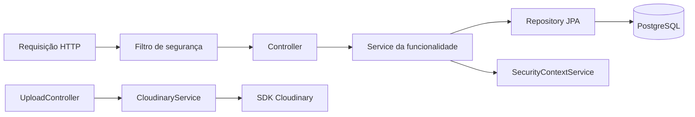

# Análise por tema

[Contexto e legenda](README.md) · [Problemas e roadmap](02-relatorio.md) · [Validação](03-validacao-e-testes.md)

## 1. Arquitetura

### Responsabilidades e direção das dependências



O filtro também consulta `UsuarioRepository` para carregar a identidade. É uma aplicação Spring MVC em camadas, não uma implementação de Clean Architecture, Hexagonal ou DDD estrito. Não há obrigação de adotar esses padrões.

**🟢 Adequado:** controllers tratam HTTP e delegam; services implementam alterações e autorização por proprietário; repositories concentram acesso JPA. Não há repository genérico caseiro sobre o `JpaRepository`. Classes pequenas e dependências majoritariamente por construtor facilitam compreensão.

**Acoplamento existente:** services retornam DTOs da API e usam repositories concretos do Spring Data; `Usuario` implementa `UserDetails`, `RoleModel` implementa `GrantedAuthority`; todas as entidades dependem de JPA. É um compromisso aceitável neste tamanho. Separar três modelos para cada recurso aumentaria mapeamento e manutenção sem requisito demonstrado.

`SecurityContextService` é uma dependência explícita, mas obtém o principal de um estado estático associado à thread. Chamadas sem contexto autenticado podem falhar no cast/acesso. Isso não demonstra falha nas rotas protegidas atuais; dificulta reutilizar services em jobs e testes. Quando isso se tornar necessário, passar a identidade explicitamente ou criar uma pequena interface de usuário atual será suficiente.

**Coesão:** `CurtidaService` cobre curtidas de coleções e seus resumos por usuário: são aspectos da mesma feature, não justificam divisão agora. `CloudinaryService` já isola a integração externa. Não há ciclo de services aparente; o compartilhamento de entidades/repositories entre funcionalidades é esperado pelo modelo.

**Underengineering:** invariantes divergentes entre DTO/entidade/service, exclusão incompleta, contrato de erro incompleto e ausência de testes (P02–P07, P12). Não falta uma camada abstrata; faltam garantias de comportamento.

**Overengineering:** nenhum estrutural relevante. Evitar adicionar interfaces a cada service ou casos de uso de uma linha apenas para seguir um diagrama. Uma interface de armazenamento só seria útil se houvesse outro provedor, teste que exigisse esse limite ou integração mais complexa.

**Crescimento:** uma única aplicação continua adequada para 5x/10x mais funcionalidades. O risco é repetir regras em vários services e depender de cascatas implícitas, não o fato de ser monólito. Centralizar poucas regras compartilhadas e ter testes custa menos que separar serviços.

Evidências: [services](../../src/main/java/dev/flmelo/mangakeeper/backend/service), [segurança](../../src/main/java/dev/flmelo/mangakeeper/backend/config/security), [entidades](../../src/main/java/dev/flmelo/mangakeeper/backend/entity).

## 2. Estrutura do projeto

```text
src/main/java/dev/flmelo/mangakeeper/backend/
├── config/{security,cloudinary,openapi}
├── controller
├── dto/{security,usuario,colecao,manga,volume,curtida}
├── entity/enuns
├── exceptions
├── infra
├── repository
└── service
src/main/resources/application.properties
src/test/java/.../MangakeeperBackendApplicationTests.java
docs/DEVLOG.md
pom.xml
mvnw
```

**🟢 Intuitiva para Spring:** não há módulo excessivamente grande; a maior classe de service analisada tem 167 linhas. Os DTOs já são agrupados por recurso. `infra` contém apenas respostas/tratamento de erro; o nome é mais amplo que seu conteúdo. `SecurityContextService` é um componente de autorização em uma pasta de configuração, uma imprecisão organizacional de baixo impacto.

**🟡 Nomenclatura:** `enuns` deveria ser `enums`; `colecaos` deveria ser `colecoes`; `UsuarioResumeDTO` usa `Id` e `nome` para representar ID e username; exceptions misturam português e inglês. Padronizar ajuda buscas, mas não é bloqueio de deploy. Evitar confundir renomeação Java com alteração do JSON público.

Com 5x/10x mais features, percorrer várias pastas técnicas para alterar uma funcionalidade pode ficar cansativo. Uma organização futura possível:

```text
backend/
├── auth/       # controller, service e DTOs de autenticação
├── usuario/    # controller, service, repository, entidade e DTOs
├── colecao/
├── manga/
├── volume/
├── curtida/
├── upload/
└── shared/
    ├── security/
    ├── error/
    └── config/
```

**Trade-off:** agrupar por feature aproxima arquivos alterados juntos; manter por camada é familiar e já funciona. Não executar uma reorganização geral antes dos testes. A integração de upload já está suficientemente isolada para o MVP.

## 3. Qualidade do código

### Achados concretos

| Evidência | Consequência | Ação proporcional |
|---|---|---|
| Construção de `MangaResponseDTO` repetida em vários métodos | Novo campo precisa ser atualizado em vários lugares | Método privado de mapeamento, sem framework obrigatório |
| Oito handlers com construção repetida de resposta | Facilita divergência de formato | Pequeno helper ou handlers agrupados quando a semântica coincidir |
| `AuthenticationService` cria `new BCryptPasswordEncoder()` | Configuração pode divergir do bean usado para login/edição | Injetar o `PasswordEncoder` existente |
| Cadastro consulta login original, salva lowercase | Cadastro/login/duplicidade podem discordar | Normalizar antes de consultar e salvar; mesma política no login |
| `MangaService.create` aplica `trim` só na resposta | POST e GET apresentam dados diferentes | Normalizar antes de persistir |
| `ColecaoService.create` aceita nome numérico e update rejeita | Mesma regra de domínio tem duas interpretações | Decidir regra única e reaproveitá-la |
| `CloudinaryService` perde causa de `IOException` | Diagnóstico incompleto | Preservar causa e registrar na fronteira de erro |
| `Curtida` define timestamp no construtor e no `@PrePersist` | O valor inicial é sobrescrito | Escolher um único momento de atribuição |
| Imports/código comentado sem uso; field injection em poucos pontos | Ruído e construção inconsistente | Limpeza localizada quando tocar o arquivo |

Não há funções enormes ou complexidade algorítmica alta. Os vários `if (campo != null)` nos PATCHs são legíveis e não constituem violação de SOLID por si só. Repetição de mapeamento é dívida pequena; validação ineficaz é dívida funcional.

### Null e regras implícitas

`RegisterDTO` permite `login=null`; o service usa `toLowerCase`. Senha nula chega ao encoder. Constraints da entidade acontecem depois dessas operações. `VolumeService.clean` trata null; `MangaService` assume campos obrigatórios do DTO de criação. Falta aplicar a validação consistente na fronteira HTTP (P02).

PATCH atualmente interpreta null como “não alterar”; não permite limpar explicitamente vários campos opcionais. Documentar esse contrato agora; introduzir representação de presença apenas se limpar campos for necessário. Não trocar todos os DTOs por mapas.

### Exemplo de refatoração pequena

```java
private MangaResponseDTO toResponse(Manga m) {
    return new MangaResponseDTO(
        m.getId(), m.getTitulo(), m.getAutor(), m.getEditora(),
        m.getGenero(), m.getSinopse(), m.getIssn(),
        m.getTotalVolumes(), m.getIdioma(), m.getColecao().getId()
    );
}
```

O helper remove duplicação, mas não deve esconder normalização: ela deve acontecer antes da persistência. As constantes de duas horas de token e offset fixo merecem revisão funcional (P04); o offset é um bug de tempo, não apenas um “magic number”.

Evidências: [MangaService](../../src/main/java/dev/flmelo/mangakeeper/backend/service/MangaService.java), [AuthenticationService](../../src/main/java/dev/flmelo/mangakeeper/backend/service/AuthenticationService.java), [Curtida](../../src/main/java/dev/flmelo/mangakeeper/backend/entity/Curtida.java).

## 4. API

### Inventário do contrato atual

| Rota | Métodos | Acesso definido no código |
|---|---|---|
| `/auth/register`, `/auth/login` | POST | Público |
| `/usuarios` | GET | Administrador |
| `/usuarios/{id}` | GET, PATCH, DELETE | Leitura pública; escrita dono/admin |
| `/usuarios/{usuarioId}/likes` | GET | Público pela regra `/usuarios/**` |
| `/colecoes`, `/mangas`, `/volumes` | GET, POST | Leitura pública; criação autenticada, com propriedade do pai quando aplicável |
| `/colecoes/{id}`, `/mangas/{id}`, `/volumes/{id}` | GET, PATCH, DELETE | Leitura pública; escrita dono/admin |
| `/colecoes/{colecaoId}/likes` | GET, POST, DELETE | Leitura pública; altera a curtida do usuário autenticado |
| `/upload` | POST multipart, campo `file` | Autenticado |
| `/swagger-ui/**`, `/v3/api-docs/**` | GET | Público |

CRUD usa substantivos, GET/POST/PATCH/DELETE e, em geral, `200`, `201` com `Location` e `204` adequados. Misturar `likes` com recursos em português é uma convenção inconsistente, não um bug REST. O matcher `/curtidas/colecao/**` não corresponde ao controller atual, mas `/colecoes/**` já libera a leitura de curtidas. Remover regra antiga reduz confusão.

### Integração com frontend

P08/P09: faltam filtros por pai, paginação e ordenação. `ColecaoRepository.findAllByUsuarioId` existe, mas não alimenta uma rota filtrada. Sem isso, o frontend teria de baixar a base inteira. Proposta:

```text
GET /colecoes?usuarioId=42&page=0&size=20
GET /mangas?colecaoId=10&page=0&size=20
GET /volumes?mangaId=30&page=0&size=20
GET /usuarios/me
```

`/usuarios/me` é sugestão autenticada, não endpoint existente; sua regra precisa vir antes do matcher público `/usuarios/**`. Não basta criar o método no controller e assumir que ele será protegido.

```java
Page<Volume> findAllByMangaId(Long mangaId, Pageable pageable);
```

Limitar `size`, permitir somente campos de ordenação conhecidos e desempatar por `id`. Pode usar `Slice` quando o total exato não for necessário, economizando COUNT; `Page` facilita uma interface com número total de páginas. Definir envelope próprio ou serialização estável, sem fazer o cliente depender de detalhes internos do `PageImpl`.

### Inconsistências de serialização

| Campo | Entrada | Saída |
|---|---|---|
| Avatar | Cadastro `avatarUrl`; PATCH `avatar_url` | `avatarUrl` |
| Código de barras | `codigo_de_barras` | `codigoDeBarras` |
| Dono da coleção | Derivado da identidade | `usuarioId`, enquanto outros relacionamentos usam snake_case |
| Curtidas | — | Mistura `total_curtidas` e `usuariosQueCurtiram` |
| Upload | Multipart | URL como texto, sem objeto JSON |

Escolher camelCase ou snake_case agora tem baixo custo porque ainda não há frontend. Os DTOs são bons limites contra exposição de entidades; não serializar `Usuario` diretamente para “facilitar” `/me`.

`AuthenticationController.register` cria `Location: /auth/register/{id}`; a leitura correta está em `/usuarios/{id}`. OpenAPI declara segurança global inclusive para operações públicas, e documenta login inválido como `400`; alinhar documentação com o contrato `401` proposto. Swagger público é uma decisão possível para API de portfólio, não vulnerabilidade automática.

### Validação, versionamento e idempotência

P02: mover `@Valid` para `@RequestBody` nos PATCHs e completar constraints. Colocar `@Valid` em um `Long` sem constraints não valida o DTO. Padronizar comprimentos com o armazenamento; email limitado a 40 caracteres é restritivo e pode rejeitar endereços legítimos. Avaliar a regra antes de expandir a coluna.

PATCH de campos escalares é compatível com edição parcial, sem necessidade imediata de JSON Patch. Repetir DELETE pode retornar `404` sem deixar de ser idempotente: o estado final continua excluído. Repetir curtir retorna conflito no caminho sequencial; pode manter `409` documentado ou modelar `PUT .../likes/me` para semântica idempotente. Idempotency keys globais seriam excessivas agora.

Não há versão na URL; isso não bloqueia MVP sem consumidores. Estabilizar contratos e exemplos vale mais que adicionar `/v1` sem política de compatibilidade. Alterações futuras precisam considerar clientes já publicados.

Evidências: [controllers](../../src/main/java/dev/flmelo/mangakeeper/backend/controller), [DTOs](../../src/main/java/dev/flmelo/mangakeeper/backend/dto), [OpenApiConfig](../../src/main/java/dev/flmelo/mangakeeper/backend/config/openapi/OpenApiConfig.java).

## 5. Banco de dados

### Modelo inferido dos mapeamentos

```text
usuarios ──< colecoes ──< mangas ──< volumes
    │             │
    └──< curtidas >──┘
usuarios >──< roles (usuarios_funcoes)
```

**🟢 Adequado:** IDs `Long` com IDENTITY; enums de idioma/role armazenados como string; FKs obrigatórias nos vínculos principais; sinopse em TEXT; username/email únicos; curtida única por `(usuario_id, colecao_id)`; mangá único por `(colecao_id, titulo, idioma)`. IDs sequenciais não são falha de segurança quando existe autorização.

A entidade `Manga` é um cadastro dentro da coleção, não um catálogo global. Duplicar título/autor entre usuários é compatível com essa escolha. Se houver catálogo compartilhado, separar obra/edição de posse passa a fazer sentido; não é uma normalização obrigatória agora. A chave única atual também impede edições distintas com mesmo título/idioma na mesma coleção: confirmar a intenção.

### Integridade e tipos

`Volume.numero` não tem positividade na entidade e o PATCH não aplica a constraint do DTO. Não há unicidade de `(manga_id, numero)`: definir se repetição significa cópias físicas válidas antes de proibi-la. `codigoDeBarras` valida 13 dígitos na entidade, mas o DTO só exige não vazio. ISBN/ISSN não possuem validação semântica; adicionar apenas conforme a regra do produto, sem afirmar que todo volume precisa desses códigos.

Constraints Bean Validation não equivalem todas a constraints SQL. O DDL efetivo precisa ser inspecionado; `@NotBlank` não deve ser tratado como CHECK SQL garantido. P05: migrations faltam e `ddl-auto=update` não fornece histórico revisável nem recuperação.

P06: a remoção de usuário elimina suas curtidas feitas; a cascata de coleções não remove por si só curtidas recebidas. Cascatas JPA não chamam outros services e não equivalem a `ON DELETE CASCADE` em todas as FKs.

### Índices e queries

Revisar índices em `colecoes(usuario_id)`, `volumes(manga_id)` e `curtidas(colecao_id)`. O índice único de mangás já começa por `colecao_id`; não duplicá-lo sem medir. O de curtidas começa por usuário e não substitui de forma geral o acesso por coleção. PostgreSQL não cria automaticamente índice no lado referente de toda FK. [Referência PostgreSQL](https://www.postgresql.org/docs/18/ddl-constraints.html).

`Curtida` usa ManyToOne eager e `Usuario.roles` é eager. Resumos percorrem relacionamentos e podem carregar objetos/queries além dos campos retornados. N+1 deve ser confirmado por contagem de SQL por tamanho da lista; acessar somente `getId()` de um proxy lazy não prova N+1. Projeções ou `@EntityGraph` pontuais são alternativas, não instrução para tornar tudo eager. [Referência Spring Data](https://docs.spring.io/spring-data/jpa/reference/jpa/query-methods.html).

### Transações, tempo e escala

Há transações nos updates/deletes e criação de mangás/volumes/curtidas. Não ter `@Transactional` em um método que faz apenas um `save` não significa que o INSERT está sem transação: repositories possuem comportamento transacional. A questão é a unidade de negócio inteira e a concorrência entre consultas/escritas.

Não há `@Version`, soft delete ou timestamps gerais de criação/edição. Soft delete não é exigência: aumenta filtros e complexidade de unicidade. `Instant` em timestamps futuros facilita consistência entre ambientes; `LocalDateTime` de curtida não expressa fuso. Auditoria extensa pode esperar, mas timestamps simples ajudam suporte.

Milhões de linhas tornam listagens integrais, COUNTs e cascatas JPA mais caros. Não há evidência medida de deadlock; exclusões concorrentes e ordem de locks devem ser investigadas se aparecerem esperas. Não introduzir locks pessimistas preventivamente. Ver seção 10.

## 6. Segurança

Evidências principais: [WebSecurityConfig](../../src/main/java/dev/flmelo/mangakeeper/backend/config/security/WebSecurityConfig.java), [SecurityFilter](../../src/main/java/dev/flmelo/mangakeeper/backend/config/security/SecurityFilter.java), [TokenService](../../src/main/java/dev/flmelo/mangakeeper/backend/service/TokenService.java), [SecurityContextService](../../src/main/java/dev/flmelo/mangakeeper/backend/config/security/SecurityContextService.java).

| Superfície | Evidência e cenário realista | Avaliação/ação |
|---|---|---|
| Secret JWT | Fallback conhecido caso `JWT_SECRET` não exista; permite assinar identidade de conta existente | 🔴 P01, obrigatório falhar na inicialização sem chave adequada |
| Validação JWT | Verifica HMAC256, issuer e expiração; assinatura não é apenas decodificada | 🟢 Preservar verificações; corrigir retorno vazio e erro de filtro em P03 |
| Tempo JWT | Hora local convertida com offset fixo | 🟠 P04; duração muda conforme timezone do servidor |
| Autorização/IDOR | Escritas consultam dono/admin; criação de coleção usa principal | 🟢 Preservar; testar matriz completa de recursos e administrador |
| Roles | Cadastro atribui `ROLE_USER` no servidor; filtro consulta roles atuais no banco | 🟢 Cliente não escolhe privilégios; role arbitrária no JWT não substitui permissões do banco |
| Senhas | BCrypt no cadastro/update; DTO de cadastro sem constraints e PATCH sem `@Valid` no corpo | 🟠 P02; senha original vazia/curta pode virar hash válido |
| Revogação | Sem comparação de versão de credencial no filtro | 🟡 P15; token roubado continua válido após troca de senha até expirar |
| Cookies/sessões | SessionCreationPolicy.STATELESS, token em Authorization, sem fluxo de cookie configurado | 🟢 Coerente; armazenamento do frontend ainda não existe |
| CSRF | Desabilitado no modelo de bearer enviado explicitamente | Adequado ao fluxo atual; rever se autenticação passar a cookie enviado automaticamente |
| CORS | Origem explícita por configuração; credentials habilitado | 🟢 Evita wildcard de origem; testar domínio real; CORS não substitui autenticação nem bloqueia clientes fora do navegador |
| Mass assignment | DTOs não recebem roles/dono para edição; setters aplicados explicitamente | 🟢 Não encontrada atribuição arbitrária de campos privilegiados |
| SQL injection | Repositories derivados, sem SQL construído com concatenação de entrada | Não encontrada evidência no código atual; futuros filtros/sorts devem validar campos |
| Command injection | Não há execução de shell/processos a partir de requisições | Sem evidência de superfície atual |
| SSRF | Upload envia bytes ao SDK; URLs de avatar/imagem são persistidas, não buscadas pelo backend | Não afirmar SSRF só por aceitar URL; reavaliar caso implemente importação remota |
| Path traversal | Nome original do upload não é utilizado como caminho de arquivo da aplicação | Sem evidência no fluxo atual |
| Upload | Autenticado, mas sem quota/validação explícita de formato, dimensões e vazio | 🟠 P10; conta barata pode consumir recursos Cloudinary repetidamente |
| Brute force/rate limit | Nenhum limitador no código/config do repositório | 🟠 P10; tentativas de login/cadastro/upload podem consumir CPU/quota; proteção de proxy é desconhecida |
| Enumeração | Cadastro informa username já existente; usernames/perfis são públicos | 🟡 Impacto limitado pelo produto; evitar expor email/causas internas e limitar tentativas |
| Erros | Advice parcial, filtro fora da fronteira MVC, causas descartadas | 🟠 P03/P07; status e corpo imprevisíveis; não afirmar vazamento de stack trace sem observar resposta |
| Logs sensíveis | Sem logging explícito de token/senha; `show-sql=true` | Não comprova parâmetros sensíveis em logs; revisar configurações finais e nunca registrar Authorization |
| Administrador | GET `/usuarios` exige ADMIN; não há endpoint de promoção de roles | 🟢 Preservar; documentar provisionamento seguro do primeiro admin sem senha fixa em migration |
| Credencial comentada | Exemplo de usuário/senha em comentário de WebSecurityConfig | 🟡 Remover; não é conta ativa; trocar apenas se a senha foi reutilizada em serviço real |
| Dependências | Bibliotecas e transitivas precisam de análise de versão/aplicabilidade | P16; ver seção 12; ausência de scanner não prova vulnerabilidade explorável |

### Senha original e hash são verificações distintas

Validar a senha recebida não exige persistir nem registrar seu texto. Primeiro validar presença/comprimento, depois gerar o hash e armazenar somente o hash. BCrypt é hash de senha, não criptografia reversível; no login usar `passwordEncoder.matches(raw, encoded)`. `@NotBlank` no hash não assegura que a senha original era não vazia.

A política atual de PATCH sugere 8–20 caracteres, mas não é aplicada. Escolher uma política consistente, compatível com os limites em bytes do encoder, em vez de apresentar o intervalo existente como padrão universal de segurança. Não aplicar `trim()` silenciosamente em senhas.

### Limites da autorização de leitura

`publico` é sempre true na criação e não existe API para privacidade. Hoje o produto é público. Antes de oferecer coleção privada, filtrar coleções, mangás, volumes e resumos de curtidas, inclusive acesso direto por ID (P14). Não há evidência de que um usuário já consiga tornar privada uma coleção via API.

## 7. Tratamento de erros

[RestExceptionHandler](../../src/main/java/dev/flmelo/mangakeeper/backend/infra/RestExceptionHandler.java) trata not found, nome inválido, duplicidade de usuário/curtida detectada em serviço e AccessDenied. Isso é uma base boa, mas erros MVC herdados, erros de persistência e falhas do filtro não têm o mesmo contrato.

`AuthenticationService.register` captura qualquer `DataIntegrityViolationException` e a recria como “Usuario já existe”, sem causa. Pode ser email, outra constraint ou corrida. A mensagem mascara a origem e não há handler específico dessa exceção. Exceções durante flush/commit podem ocorrer fora de um `try` que envolve apenas `save`; mapear no limite apropriado e considerar a constraint conhecida.

`CloudinaryService` captura `IOException`, elimina sua causa e lança RuntimeException genérica. Um upload externo pode ter completado antes de uma falha de rede percebida pelo cliente; retries automáticos cegos podem duplicar ativos. Definir timeout finito, erro externo reconhecível e registrar causa uma única vez.

Proposta de contrato: `400` entrada inválida com campos; `401` autenticação inválida; `403` autorização; `404` recurso inexistente; `409` conflito conhecido; `413` tamanho de upload; `502/503` conforme a natureza da falha externa; `500` falha inesperada com mensagem genérica. Não retornar stack trace, SQL ou segredo ao cliente.

Pode manter DTO próprio, por exemplo `{code, message, fieldErrors, requestId}`, ou adotar `ProblemDetail`. Trade-off: DTO próprio é simples para o cliente atual; ProblemDetail oferece formato conhecido e integração MVC. O importante é uniformizar também o filtro com `AuthenticationEntryPoint`/tratamento explícito de falha de autenticação. [Spring Security](https://docs.spring.io/spring-security/reference/servlet/authentication/architecture.html).

**Investigação de incidente hoje:** logs padrão ajudam, mas ausência de request ID, causa perdida e erro genérico tornam a correlação difícil. Não confundir “não há logging próprio” com “não existe nenhum log”: o Spring registra inicialização e várias falhas.

## 8. Observabilidade

| Capacidade | Estado no repositório | Próxima ação proporcional |
|---|---|---|
| Logs estruturados | Não configurados | Usar saída estruturada se a plataforma consumir; logs simples consistentes já ajudam |
| Request/correlation ID | Não implementado | Gerar/validar ID, colocar em MDC e devolver no erro; limpar MDC ao finalizar |
| Métricas | Sem Actuator/Micrometer explicitamente configurados | Começar por taxa de erro, duração HTTP e pool de conexões quando houver coleta |
| Tracing | Ausente | 🔵 Adiar; há uma aplicação e uma integração externa |
| Health | Sem endpoint dedicado | Adicionar Actuator ou endpoint mínimo; expor status sem detalhes sensíveis |
| Readiness | Sem verificação explícita | Considerar banco necessário; não reiniciar a aplicação continuamente por falha externa |
| Monitoramento/alertas | Nenhum arquivo/config encontrado | Uptime externo e alertas da plataforma para indisponibilidade/erros |

Cloudinary fora do ar pode tornar apenas upload indisponível; não precisa tornar todo CRUD não pronto. Ao adicionar Actuator, cuidar da configuração de segurança: não liberar todos os endpoints administrativos. P13.

## 9. Performance e escalabilidade

**Atuais, sem depender de grande tráfego:** listagens integrais; resumo de curtidas inclui todas as pessoas; ausência de consultas por pai; upload síncrono com cópia `getBytes()`. Esses caminhos têm custo que cresce com dados ou latência externa.

**CPU:** BCrypt tem custo deliberado; tráfego abusivo de login/cadastro precisa de limite, não de hash mais fraco. **Memória:** entidades/listas/JSON integrais e buffers de upload são os pontos concretos. **I/O:** conexão com PostgreSQL e Cloudinary; falta orçamento explícito de timeout externo. **Pool:** Hikari é fornecido pelo starter; falta dimensionar com número de instâncias/conexões do banco, não implementar um pool.

Uma requisição autenticada consulta o usuário e roles. Isso aumenta custo, mas permite observar remoção de conta e mudança de permissões. Cachear identidades acrescenta invalidação; medir antes. P08/P10/P11.

| Escala relativa | Cenário plausível, não capacidade medida | Primeiro diagnóstico |
|---|---|---|
| 10x | Uma instância pode continuar suficiente; listas maiores e fotos reais revelam limites | Latência por rota, tamanho de resposta e tempo de upload |
| 100x | Consultas adicionais, COUNTs, pool e threads bloqueadas podem dominar | SQL/EXPLAIN, número de queries, conexões e timeouts |
| 1000x | Contenção no banco, excesso de payload e pressão de memória podem exigir mais capacidade | Teste representativo antes de escalar instâncias e banco |

Sem carga inicial, tamanho das bibliotecas e hardware, “1000x” não corresponde a uma quantidade conhecida de usuários. Dados também podem crescer sem tráfego crescer na mesma proporção.

**Futuro:** cascatas JPA em bibliotecas grandes; conflitos de edição; upload direto assinado com limites para reduzir o tráfego pelo servidor. **Prematuro:** microservices, Redis, Kafka, Kubernetes, CQRS, Event Sourcing, particionamento ou troca de ORM sem medição. Filas só fariam sentido com processamento assíncrono real; cache só com consultas custosas/repetidas identificadas.

## 10. Concorrência e consistência

### Curtida duplicada: check-then-act (P07)

1. A e B, do mesmo usuário e coleção, consultam `exists...` antes de qualquer inserção.
2. Ambas leem false.
3. A insere e confirma.
4. B tenta inserir e a constraint única rejeita.

Ter coleção por usuário não impede isso: duas abas, clique repetido ou retry já geram concorrência. A constraint é correta e deve permanecer. `@Transactional` sozinho não serializa o par consulta/inserção. Tratar conflito `409` ou tornar a operação idempotente deliberadamente; teste com duas conexões/transações independentes.

### Cadastro concorrente (P07/P09)

Duas requisições consultam username livre e tentam inserir; a unicidade resolve o conflito no banco. A checagem prévia serve à experiência, não é garantia de integridade. Normalizar antes de ambas as operações. Email único pode gerar o mesmo tipo de disputa.

### Lost update (P11)

1. A e B carregam a mesma entidade na versão inicial.
2. A altera e confirma.
3. B confirma uma alteração baseada no estado antigo.
4. Sem verificação de versão, a gravação pode sobrescrever valores de A. O SQL efetivo determina quais campos são atualizados.

Uma evolução é `@Version private Long version;`, migration da coluna e tratamento de conflito otimista. Isso detecta transações sobrepostas; se o cliente ficar minutos editando antes de iniciar sua requisição, também precisa enviar a versão esperada/ETag para detectar formulário desatualizado. Pessimistic locking aumenta espera e risco de deadlocks; não se justifica como padrão aqui.

### Atomicidade de exclusão e integração externa

A exclusão deve remover curtidas necessárias e o grafo de recursos na mesma transação (P06). Curtida chegando simultaneamente à exclusão pode ainda encontrar conflito de FK; a resposta precisa ser previsível e não deixar referências órfãs. Não houve teste sistemático de todas as ordens de locks.

Upload Cloudinary e gravação PostgreSQL não participam de uma mesma transação local. Imagem pode existir sem volume salvo; manter public_id/proprietário permite compensar ou limpar órfãos depois. Não introduzir transação distribuída. Não há pagamentos ou processamento financeiro no projeto, portanto deduplicação desse tipo não é aplicável.

### Consistência de resumo

COUNT e lista de curtidas são consultas diferentes; uma alteração entre elas pode gerar total/lista momentaneamente distintos, mesmo com transação no isolamento usual READ COMMITTED. Para curtidas isso pode ser aceitável. Separar total e lista paginada reduz custo sem prometer um snapshot global.

## 11. Testes

O único arquivo versionado é [MangakeeperBackendApplicationTests](../../src/test/java/dev/flmelo/mangakeeper/backend/MangakeeperBackendApplicationTests.java), com `@SpringBootTest` e `contextLoads()`. Ele pode detectar falha de inicialização quando o ambiente está configurado, mas não prova regras de negócio, HTTP, autorização ou integridade. Não há fixtures, factories, mocks ou testes E2E adicionais versionados.

Services com injeção por construtor são fáceis de instanciar. `SecurityContextService` pode ser mockado; consultas, commits, filtros e cascatas exigem testes de integração. Usar só repositories mockados esconderia os bugs mais relevantes desta revisão. Não existe percentual de cobertura medido.

Fluxos que podem quebrar silenciosamente: senha fraca/volume inválido aceitos, propriedade regressiva, token com duração incorreta, contrato divergente entre POST/GET e atualização perdida. Outros falham visivelmente só com dados reais: roles ausentes, curtidas recebidas e constraints concorrentes.

Os dez testes priorizados, com preparação e resultados esperados, estão no [plano de validação](03-validacao-e-testes.md). Reproduções pontuais desta auditoria não são testes de regressão adicionados ao projeto. A suíte precisa usar PostgreSQL isolado; H2 não deve ser tratado como prova de equivalência de constraints, locks e SQL.

## 12. Dependências

Evidência: [pom.xml](../../pom.xml).

| Biblioteca | Papel | Avaliação |
|---|---|---|
| Spring Boot/Web | Servidor, MVC, JSON e configuração | 🟢 Essencial à stack atual |
| Data JPA/Hibernate + PostgreSQL | Persistência e driver | 🟢 Adequado ao CRUD relacional |
| Validation | Constraints de entrada/entidade | 🟢 Já existe; corrigir aplicação antes de adicionar outra biblioteca |
| Spring Security | AuthenticationManager, filtros e BCrypt | 🟢 Essencial ao modelo atual |
| Auth0 Java JWT 4.5.2 | Emissão/verificação JWT | 🟢 Uso concreto; não reimplementar criptografia |
| Cloudinary HTTP5 2.0.0 | Upload externo | 🟢 Uso concreto; revisar atualizações compatíveis e transitivas |
| springdoc 2.8.17 | OpenAPI/Swagger UI | 🟢 Útil para frontend e portfólio |
| Lombok | Construtores/acessores em algumas classes | Opcional; Java nativo cobre seu uso, mas removê-lo não traz grande benefício |
| DevTools | Conveniência no desenvolvimento | Manter apenas no fluxo de desenvolvimento; conferir artefato de produção |
| Starter Test | JUnit, Mockito e ferramentas de teste | 🟢 Adequado, mas pouco aproveitado |

Não há biblioteca evidentemente sem função que justifique remoção urgente. Não introduzir MapStruct apenas para quatro recursos nem outro validador junto ao Jakarta Validation.

### Segurança e atualização

O JAR analisado contém Spring Security 6.5.9. A consulta aos avisos oficiais encontrou faixas afetadas que incluem essa versão, mas exploração depende do recurso utilizado. DPoP e WebAuthn distribuído dos avisos consultados não aparecem na aplicação. O aviso de Sort nativo de Spring Data JPA exige consultas nativas com ordenação de entrada, ausentes aqui. Isso não autoriza declarar o conjunto de dependências seguro: não houve SCA completo de todas as transitivas.

- [CVE-2026-41707: DPoP](https://spring.io/security/cve-2026-41707/).
- [CVE-2026-47841: WebAuthn](https://spring.io/security/cve-2026-47841/).
- [CVE-2026-47834: Sort em query nativa](https://spring.io/security/cve-2026-47834/).

P16: antes de publicar, gerar inventário resolvido e executar scanner de dependências; avaliar alcance dos avisos, suporte e atualização compatível, mantendo versões gerenciadas pelo BOM quando possível. Não atualizar arbitrariamente uma dependência central para outra geração sem teste de compatibilidade. SDK e documentação oficial do provedor são referências para a integração [Cloudinary Java](https://github.com/cloudinary/cloudinary_java).

## 13. Configuração e infraestrutura

Evidência: [application.properties](../../src/main/resources/application.properties), [pom.xml](../../pom.xml) e inventário do repositório.

| Item | Estado | Requisito para primeiro deploy |
|---|---|---|
| Banco | URL localhost no arquivo | Sobrescrever por `SPRING_DATASOURCE_URL`; username/password por configuração segura |
| Secrets | DB e Cloudinary usam placeholders; JWT tem fallback | Remover fallback e validar configuração obrigatória |
| Ambientes | Um properties sem profiles próprios | Overrides externos já funcionam; perfil prod pode documentar defaults diferentes |
| Schema | `ddl-auto=update` | Migrations + validação de schema; dados iniciais de roles |
| SQL em log | `show-sql=true`, formatado | Desligar em produção por padrão |
| Docker/compose | Não versionados | Opcionais; compose local de banco pode melhorar DX |
| CI/CD | Não encontrado | Build e testes com banco descartável; deploy depois de passar |
| Artefato | JAR executável | Usar runtime Java compatível e comando explícito |
| Porta | Padrão do Boot | Configurar porta da plataforma (`SERVER_PORT` ou mapeamento explícito de PORT) |
| Pool | Autoconfiguração do starter | Dimensionar conforme limite PostgreSQL e quantidade de instâncias |
| HTTPS/proxy | Não configurado no repo | TLS na plataforma/proxy, testar URL pública e `Location`; confiar em forwarded headers só de proxy confiável |
| Encerramento | Defaults do Boot | Entrega de SIGTERM e janela de término suficientes |
| Backup/recovery | Não documentados | Backup persistente e restauração ensaiada em banco separado |
| Rollback | Sem procedimento | Artefato anterior e migrations compatíveis; restaurar dados é ação distinta |

Não confundir falta de configuração explícita com falta de capacidade: graceful shutdown é habilitado por padrão na linha Boot 3.5. [Referência oficial](https://docs.spring.io/spring-boot/3.5/reference/web/graceful-shutdown.html). Limites multipart também existem por padrão (1 MB/arquivo e 10 MB/requisição), embora não expressem uma decisão do produto. [Propriedades oficiais](https://docs.spring.io/spring-boot/3.5/appendix/application-properties/).

Exemplo proposto de produção, a aplicar somente depois de introduzir migrations:

```properties
spring.jpa.hibernate.ddl-auto=validate
spring.jpa.show-sql=false
api.security.token.secret=${JWT_SECRET}
```

Um simples `validate` agora, em banco vazio, não cria tabelas. Tampouco migration é backup. Documentar perda de dados tolerável (RPO) e tempo de recuperação desejado (RTO) em termos simples; um projeto pessoal não precisa de infraestrutura pesada, mas precisa saber restaurar seus dados.

## 14. Developer Experience

[README](../../README.md) tem apenas nome e objetivo. [DEVLOG](../DEVLOG.md) registra problemas úteis de Postman/Jackson, mas não é um guia de instalação. O wrapper fixa o Maven, porém `mvnw` está com modo Git `100644`, e `./mvnw` falhou por permissão; `bash mvnw` funciona. Corrigir a permissão executável quando implementar melhorias.

Outro desenvolvedor precisa descobrir por conta própria banco, roles iniciais, variáveis, Cloudinary e sequência das chamadas. Não há `.env.example`, seeds/migrations ou coleção de requisições. `*.env` no `.gitignore` não constitui configuração automática de dotenv: criar `.env` sozinho não faz o Spring Boot carregá-lo. Documentar como o shell, IDE ou plataforma injeta as variáveis.

README mínimo proposto: requisitos de Java/PostgreSQL; variáveis sem valores reais; criação do banco via migrations; comandos `bash mvnw test`, `bash mvnw package` e `java -jar ...`; URL da documentação; exemplo de cadastro/login/bearer e multipart; problemas comuns; instruções de backup/deploy. Um exemplo de ambiente deve conter placeholders fictícios e não valores de contas reais.

Não foi confirmado build em Java 17 real: o ambiente de análise usa Java 21 e compila com alvo 17. Colocar a versão de produção no CI resolve essa incerteza. P12/P13.

## 15. Manutenibilidade em dois anos

As classes pequenas favorecem manutenção. O risco maior é conhecimento implícito: roles inseridas manualmente, significado de `publico`, significado de mangá versus catálogo, duplicatas de volumes, exceções dependentes do caminho de persistência e cascatas não documentadas.

Não há service circular aparente. Autenticação, exclusão de conta e upload são os pontos com maior chance de acumular regras e incidentes; proteger seus limites antes de adicionar features. A tabela de roles e um único service de curtidas não são problemas de manutenção atuais.

Registros curtos de decisão podem explicar: todas as coleções são públicas no MVP; mangá pertence ao usuário via coleção; política de username; política de repetição de volumes; erro/retry em curtida; vínculo e limpeza de imagens. Não criar um catálogo de documentos sem proprietário: atualizar junto às mudanças de comportamento.

**Sequência de maior retorno:** contratos e invariantes consistentes → testes de regressão → migrations e operação reproduzível → refatoração localizada. Reorganização de pastas e novas abstrações devem responder a dificuldades observadas, não a uma nota estética.
